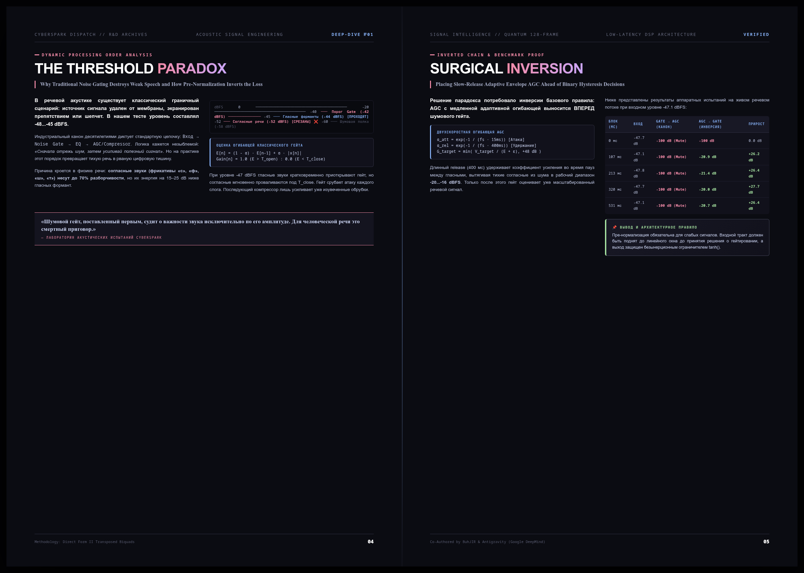

# CYBERSPARK DISPATCH // R&D JOURNAL

> **Official Publication of the CyberSpark R&D Collective.**  
> Written in Co-Authorship by **BuhJIR & Antigravity (Google DeepMind Agentic Pair)**.

---

## 📖 ISSUE №01: THE THRESHOLD PARADOX
### *Why Traditional Noise Gating Destroys Weak Speech and How Pre-Normalization Inverts the Loss*

### Summary:
* **The Problem:** In weak signal acoustics (-48...-45 dBFS), standard signal chains (`Gate → EQ → AGC`) fail. Noise gates judge phonetic importance solely by amplitude, silently killing low-energy consonants (fricatives *s, sh, f, t* that carry 70% of speech intelligibility).
* **The Inversion:** Moving a slow-release adaptive envelope AGC *ahead* of the noise gate lifts weak phonetic attacks by **+27 dB** into the linear window before binary gating decisions.
* **Benchmark:** Full 7-stage Direct Form II Transposed IIR biquad chain executes in **0.239 ms** per 128-frame quantum (2.66 ms budget) on pure Python / Linux kernel 6.14.

---

## 🏛️ EDITORIAL ARCHITECTURE

The journal layout is built on the **Swiss 12-Column Grid System**, synthesizing visual and editorial principles from *032c*, *Monocle*, *Wired (90s Avant-Garde)*, and *Phrack*.

* 🎨 **Live Web Spread:** [https://buhjir.github.io/cyberspark-dispatch/](https://buhjir.github.io/cyberspark-dispatch/)
* 📝 **Full Article:** [`article_dsp_paradox.md`](article_dsp_paradox.md)
* 📐 **Editorial Code:** [`EDITORIAL_SYSTEM.md`](EDITORIAL_SYSTEM.md)

---

## 📄 License

MIT © 2026 BuhJIR & Antigravity
